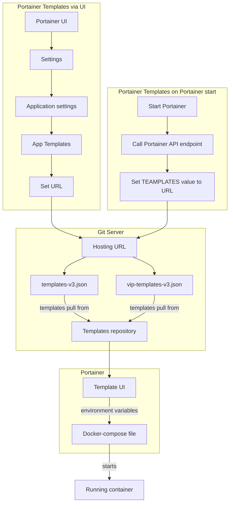

# Portainer Templates

## Scope

Telos Alliance's portainer templates are used to deploy Telos Alliance container products. These templates **SHOULD** only be used as part of the Telos Alliance Container Setup Tool (TACST) or VIP System.

These templates will not work on other systems. If a container product is being deployed with out TACST or VIP please [contact customer support](https://www.telosalliance.com/support-request).

## What are Portainer templates?

Portainer has an option where you can create predetermined templates to easily deploy containers inside Portainer. The way Telos Alliance has implemented templates is based on docker compose files to bring the containers on line. What determines the containers shown in Portainer and the options for the container are json files.

## How do Portainer templates work

Portainer pulls the templates in over the internet from the Telos Alliance GitHub server. Each template file in this project has a unique purpose. The templates a system use can be changed by adjusting the URL in the Portianer UI. The next sections explain the purpose of each template, and the how to change between templates.

Since templates are delivered by pulling on a URL from GitHub Portainer templates are updated in customer system as soon as changes are pushed to main. As such the any change pushed to main will automatically update systems in production.

### templates-v3.json

templates-v3.json is the standard production template for Telos Alliance Container Setup Tool. Products listed in templates-v3.json are fully released by Telos Alliance. All customer with TACST or VIP will get this update as soon as it is on master.

### vip-templates-v3.json

vip-templates-v3.json is the standard production template for VIP Systems. Products listed in vip-templates-v3.json are fully released by Telos Alliance. All customers with VIP Systems will get this update as soon as it is on master.

VIP has special templates to support additional VIP Products (Panels, VIP Server, and Dashboard) only available to VIP customers. There are also some special considerations for general products, like VXS, that must be accounted for in VIP system.

## How to change templates in a product

By default products that can use templates have the appropriate template in place when Portainer starts. If the template needs to be changed the steps below can be used on a running system.

1. Log into portainer
1. Select the local instance of portainer
1. Navigate to settings for Portainer
1. Find the app template setting
1. Delete the URL in the app template
1. Copy paste the the the url for app template you want to use into the app template line. The list of app template URLS is below.

    | Template Name | URL |
    |---------------|-----|
    |templates-v2|<https://github.com/TelosAlliance/portainer_templates/raw/main/templates-v3.json>|
    |vip-templates|<https://github.com/TelosAlliance/portainer_templates/raw/main/vip-templates-v3.json> |

1. Press save
1. Navigate to the App Template menu
1. The product list you switched to is now present.

> **WARNING:** Portainer versions 2.18 and earlier require version 2 portainer templates.
>| Template Name | URL |
>|---------------|-----|
>|templates-v2|<https://gitlab.zephyr.com/devops/portainer-templates-development/-/raw/master/templates-v2.json>|
>|vip-templates-v2|<https://gitlab.zephyr.com/devops/portainer-templates-development/-/raw/master/vip-templates-v2.json> |

## More information

For more information about Telos Alliance Portainer templates please [contact customer support](https://www.telosalliance.com/support-request).